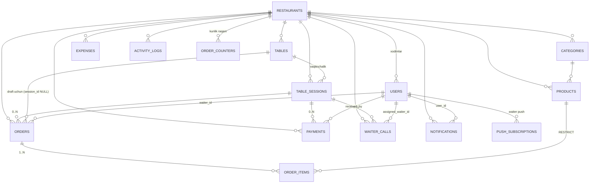

# 05 — PHASE 0: TASDIQLASH UCHUN REJA

> Holat: **tasdiqlanmagan draft**. Kod yozilmagan.
> Manba: `CLAUDE.md`, `docs/01-04`.
> Yangi kirish sharti: **hosting = cPanel shared** (Redis yo'q, Reverb yo'q, Pusher, disk 1 GB).
> Deploy PHASE 16 da. Hozir faqat repo ichida ishlaymiz — lekin repo strukturasi shu cheklovga mos quriladi.

---

## 0. HOSTING CHEKLOVI VA UNING TA'SIRI

cPanel shared hosting `docs/01-ARCHITECTURE.md` va `docs/03-PHASES.md` dagi 3 ta texnik tanlovni o'zgartiradi. Business logic **umuman o'zgarmaydi**.

| Qatlam | Doc'dagi tanlov | cPanel uchun tanlov | Sabab |
|---|---|---|---|
| WebSocket | Laravel Reverb | **Pusher Channels** (`pusher/pusher-php-server` + `laravel-echo` + `pusher-js`) | Reverb doimiy PHP process talab qiladi, shared hostingda mumkin emas |
| Cache | Redis | **`database`** cache driver (`cache` + `cache_locks` jadvallari) | Redis yo'q. `file` driver 1 GB diskda inode yeydi va atomic lock ishonchsiz. `database` driver Laravel 11 da `LockProvider` — rate limiting va session lock ishlaydi |
| Queue | Redis queue + supervisor | **`database`** queue + cPanel cron (`queue:work --stop-when-empty --max-time=55`, har daqiqa) | Supervisor yo'q |
| Broadcast queue | queue | **`sync`** (birinchi bosqichda) | Pusher HTTP chaqiruvi ~100-200 ms. Real-time xabar 1 daqiqa kechikmasligi kerak. Yuk oshsa `database` queue'ga o'tkaziladi |
| Scheduler | supervisor/systemd | cPanel cron: `php artisan schedule:run` har daqiqa | — |
| Session (Laravel) | Redis | `database` (API stateless, faqat `/broadcasting/auth` uchun) | — |
| Log | daily, cheksiz | `daily`, `LOG_DAILY_DAYS=7` + `activity_logs` prune | 1 GB disk |

### 1 GB disk byudjeti (taxminiy)

| Nima | Hajm |
|---|---|
| `backend/vendor` (prod, `--no-dev`) | ~80 MB |
| Laravel framework + kod | ~15 MB |
| 3 ta frontend `dist` (gzip'lanmagan) | ~6 MB |
| Mahsulot rasmlari (webp, ~120 KB × 300 mahsulot) | ~40 MB → **limit 300 MB** |
| Log (7 kun) | ~50 MB (cap) |
| Zaxira / o'sish | qolgani |

Majburiy qoidalar (PHASE 1 dan boshlab):
- `node_modules` **hech qachon serverga chiqmaydi** — build lokalda/CI da, faqat `dist` yuklanadi.
- Rasm yuklashda darhol resize + webp (max 1200px, max 300 KB), original saqlanmaydi.
- `activity_logs` va `notifications` uchun retention (90 / 30 kun) + scheduler prune command.
- `storage/framework/cache` ishlatilmaydi (cache = database).

### Pusher free plan cheklovi (muhim)

Free plan: **100 concurrent connection**, 200k message/kun.
20 stol × mijoz telefoni + admin + 3 waiter → mijozlar WS ga ulansa limit tez tugaydi.

**Taklif:** WebSocket faqat **Admin + Waiter** uchun. **Customer polling** ishlatadi (order status ekranida 4 soniyada bir `GET /orders/{id}`). Bu:
- connection limitini ~10 ga tushiradi,
- mijoz telefonida batareya/traffic tejaydi,
- `docs §10` dagi `public-table.{nfc_token}` kanalining xavfsizlik muammosini ham hal qiladi (pastda §3.6).

→ **SAVOL 1** (§5).

---

## 1. REPOSITORY STRUKTURASI REJASI

`CLAUDE.md §5` asos, cPanel va workspace uchun kengaytirilgan.

```
smart-restaurant/
├── CLAUDE.md
├── README.md
├── .editorconfig  .gitattributes  .gitignore
├── .github/workflows/ci.yml           # test + build (deploy YO'Q)
│
├── docs/
│   ├── 01-ARCHITECTURE.md
│   ├── 02-I18N-RU-UZ.md
│   ├── 03-PHASES.md
│   ├── 04-TEST-SCENARIO.md
│   ├── 05-PHASE0-PLAN.md              # shu fayl
│   ├── 06-API-CONTRACT.md             # PHASE 1 da §3 dan ajratiladi
│   ├── 07-DEPLOY-CPANEL.md            # PHASE 16 da yoziladi
│   └── PROGRESS.md
│
├── backend/                           # Laravel 11
│   ├── app/
│   │   ├── Enums/                     # OrderStatus, SessionStatus, TableStatus,
│   │   │                              # WaiterStatus, PaymentStatus, PaymentMethod,
│   │   │                              # WaiterCallStatus, UserRole, NotificationType
│   │   ├── Models/                    # 13 model + BaseModel (restaurant scope trait)
│   │   ├── Services/
│   │   │   ├── SessionService.php
│   │   │   ├── OrderService.php
│   │   │   ├── WaiterAssignmentService.php
│   │   │   ├── PaymentService.php
│   │   │   ├── NotificationService.php
│   │   │   ├── ReportService.php
│   │   │   ├── TableStatusService.php   # QO'SHILDI — table.status yagona yozuvchisi
│   │   │   ├── OrderNumberService.php   # QO'SHILDI — kunlik raqam, race-safe
│   │   │   └── ImageService.php         # QO'SHILDI — resize/webp (1 GB disk)
│   │   ├── Events/                    # docs §10 dagi 12 event
│   │   ├── Listeners/
│   │   ├── Observers/                 # ActivityLogObserver
│   │   ├── Policies/
│   │   ├── Exceptions/                # BusinessException (error_code + ru/uz)
│   │   ├── Support/
│   │   │   ├── ApiResponse.php        # {success,data,message_ru,message_uz,error_code}
│   │   │   └── Money.php
│   │   └── Http/
│   │       ├── Middleware/            # SetLocale, ResolveCustomerSession,
│   │       │                          # ResolveTableByNfcToken, EnsureRestaurantScope
│   │       ├── Requests/              # har endpoint uchun FormRequest
│   │       ├── Resources/             # API Resource (locale-aware)
│   │       └── Controllers/Api/V1/
│   │           ├── Customer/   Waiter/   Admin/   HealthController.php
│   │   
│   ├── config/  routes/  (api.php, channels.php, console.php)
│   ├── database/
│   │   ├── migrations/                # §2
│   │   ├── factories/  seeders/
│   ├── lang/ru/  lang/uz/             # validation, errors, notifications
│   ├── storage/app/public/products/
│   ├── tests/{Unit,Feature}/
│   └── .env.example
│
├── frontend/                          # npm workspaces (root package.json)
│   ├── package.json                   # workspaces: shared, customer, admin, waiter
│   ├── shared/                        # @sr/shared — build qilinmaydi, source import
│   │   ├── i18n/{index.ts, ru.json, uz.json}
│   │   ├── api/{client.ts, endpoints.ts, errors.ts}
│   │   ├── types/                     # backend Resource'lariga mos TS type
│   │   ├── format/                    # money, date, ordinal (1-50 ru/uz)
│   │   └── realtime/                  # echo.ts + PollingFallback
│   ├── customer/                      # Vite + React + TS + Tailwind, PWA
│   ├── admin/
│   └── waiter/                        # PWA + push
│
└── deploy/                            # PHASE 16 da to'ldiriladi, hozir bo'sh skelet
    ├── htaccess/                      # api va SPA uchun .htaccess namunalari
    ├── cron.txt                       # cPanel cron qatorlari
    └── checklist.md
```

### Qarorlar va sabablari

1. **`frontend/` npm workspaces.** 3 ta app `shared` ni `@sr/shared` deb import qiladi (relative `../../shared` emas). Bitta `node_modules`, i18n kalitlari bitta joyda — `docs §02` talabi.
2. **`shared` build qilinmaydi**, TS source sifatida import qilinadi (Vite `resolve.alias` + `optimizeDeps.include`). Ortiqcha build qadami yo'q.
3. **`Enums/` alohida papka** — `docs §3` dagi status matritsasi PHP enum + `canTransitionTo()` metodi bilan bitta joyda.
4. **3 ta yangi Service** qo'shildi (`TableStatusService`, `OrderNumberService`, `ImageService`) — pastda sabablari (§2.4, §2.5, §0).
5. **`deploy/` hozirdan mavjud**, lekin bo'sh — PHASE 16 gacha unga tegilmaydi. Repo strukturasi keyin qayta qurilmasin.
6. **CI da deploy yo'q.** GitHub Actions faqat `phpunit` + `npm run build` + i18n parity test. cPanel ga chiqarish qo'lda (PHASE 16).

### cPanel dagi kelajakdagi joylashuv (faqat ma'lumot uchun, PHASE 16)

```
~/apps/backend/          ← Laravel (public_html DAN TASHQARIDA)
~/public_html/           ← customer dist
~/public_html/admin/     ← admin dist
~/public_html/waiter/    ← waiter dist
api.domain.uz            ← subdomain, docroot = ~/apps/backend/public
```
→ **SAVOL 2** (§5): subdomain'lar (`admin.domain.uz`) yoki subdirectory (`domain.uz/admin`)? Bu Vite `base` va cookie/CORS sozlamalariga ta'sir qiladi, PHASE 1 da bilish kerak.

---

## 2. DATABASE SCHEMA REJASI

`docs/01-ARCHITECTURE.md §5` asos. Quyida ER munosabatlar, aniqlashtirishlar va **doc'da yetishmayotgan** joylar.

### 2.1 ER munosabatlar



Kalit qoida (`CLAUDE.md §2.3`): **`tables` va `table_sessions` hech qachon birlashtirilmaydi.**
`tables` = fizik stol (doimiy, NFC tag unga yopishtirilgan).
`table_sessions` = mijozlar guruhi (vaqtinchalik, `opened_at` → `closed_at`).

### 2.2 Jadvallar (16 ta + Laravel'ning 5 tasi)

Biznes jadvallari (`docs §5` dagi 13 ta + 3 ta yangi):

| # | Jadval | Doc'da bormi | Izoh |
|---|---|---|---|
| 1 | `restaurants` | ✅ | — |
| 2 | `users` | ✅ | admin + waiter |
| 3 | `tables` | ✅ | — |
| 4 | `table_sessions` | ✅ | + `public_id`, + `active_key` (§2.3) |
| 5 | `categories` | ✅ | — |
| 6 | `products` | ✅ | — |
| 7 | `orders` | ✅ | + `DRAFT` status, + `draft_expires_at` (§2.4) |
| 8 | `order_items` | ✅ | — |
| 9 | `payments` | ✅ | — |
| 10 | `waiter_calls` | ✅ | `created_by` polymorph (§2.6) |
| 11 | `notifications` | ✅ | — |
| 12 | `expenses` | ✅ | — |
| 13 | `activity_logs` | ✅ | + retention |
| 14 | **`order_counters`** | ❌ YANGI | kunlik `order_number` race-safe (§2.5) |
| 15 | **`push_subscriptions`** | ❌ YANGI | waiter web push (PHASE 7 talabi) |
| 16 | **`settings`** | ❌ YANGI | restoran sozlamalari (ovoz on/off, volume, draft TTL) — `restaurant_id + key + value` |
| 17 | **`session_devices`** | ❌ YANGI | SAVOL 9: bir stolda bir necha telefon bitta sessionni bo'lishadi — har qurilma o'z `customer_token_hash` ini oladi |

Laravel infratuzilma jadvallari (Redis yo'qligi uchun **majburiy**):
`personal_access_tokens`, `cache`, `cache_locks`, `jobs`, `failed_jobs`, `job_batches`, `sessions`.

→ **Jami 24 migration** (`docs/03-PHASES.md` PHASE 2 da "13 ta" deb yozilgan — cPanel va SAVOL 9 tufayli yangilanadi).

### 2.3 `table_sessions` — concurrency (`docs §04` "Concurrency" testi)

Muammo: bir stolga ikki telefon bir vaqtda `POST /sessions` yuborsa 2 ta ACTIVE session paydo bo'lishi mumkin.

Yechim — **ikki qatlamli**:
1. **DB darajasida:** generated column
   `active_key = IF(status IN ('ACTIVE','WAITING_PAYMENT'), table_id, NULL)` + `UNIQUE(active_key)`.
   MySQL 8 / MariaDB 10.2+ da ishlaydi, NULL lar unique indexda takrorlanishi mumkin → yopilgan sessionlar cheklanmaydi. Bu **kafolat**.
2. **App darajasida:** `SessionService::openSession()` ichida `tables` qatorini `lockForUpdate()` bilan olish → ikkinchi so'rov kutadi va mavjud sessionni qaytaradi (409 emas, **200 + mavjud session** — bir stoldagi ikki telefon bitta sessionni bo'lishadi).

Qo'shimcha ustunlar:
- `public_id` — random 32 belgi, **broadcast kanal nomi uchun** (`nfc_token` o'rniga, §3.6).
- `customer_token` — 64 belgi random. **DB da SHA-256 hash saqlanadi** (`customer_token_hash`, unique). Bu bearer token — plaintext saqlash `docs §13` xavfsizlik talabiga zid. Mijozga faqat bir marta (yaratilganda) qaytariladi, u `localStorage` da saqlaydi.
  ⚠️ Bu `docs §5` dagi `customer_token` ustun nomidan farq qiladi — **tasdiqlash kerak** (SAVOL 3).

### 2.4 Draft order — doc'dagi eng katta bo'shliq

`docs §12` va `04-TEST-SCENARIO` 18-qadam: order `session_id = NULL` bilan saqlanadi.
Lekin `docs §3` status matritsasida **draft uchun status yo'q**. Agar draft `PENDING` bo'lsa:
- admin panelida yangi order sifatida ko'rinadi ❌
- "yetkazilmagan order bor" tekshiruviga tushadi ❌
- avtomatik waiter assign qilinadi ❌

**Taklif:** `OrderStatus` ga `DRAFT` qo'shiladi, matritsa kengaytiriladi:

```
DRAFT              → PENDING | CANCELLED | EXPIRED
PENDING            → ACCEPTED | CANCELLED
ACCEPTED           → ASSIGNED | WAITING_FOR_WAITER | CANCELLED
WAITING_FOR_WAITER → ASSIGNED | CANCELLED
ASSIGNED           → WAITER_ACCEPTED
WAITER_ACCEPTED    → DELIVERING
DELIVERING         → DELIVERED
DELIVERED / CANCELLED / EXPIRED → (final)
```

`DRAFT` orderlar: hech qanday ro'yxatda ko'rinmaydi, broadcast qilinmaydi, waiter'ga assign qilinmaydi.
Qo'shimcha ustunlar: `draft_expires_at` (default +2 soat), `is_draft` emas — status yetarli.
Scheduler har 10 daqiqada muddati o'tgan draftlarni `EXPIRED` qiladi (aks holda 3 soat oldingi cart to'lovdan keyin "tirilib" ketadi).

→ **SAVOL 4** (§5): bitta stolda **2 ta har xil telefon** draft qoldirsa nima bo'ladi?

### 2.5 `order_number` — race condition

`docs §5` da `order_number` bor, lekin generatsiya qoidasi yo'q.
`MAX(order_number)+1` shared hostingda ikki bir vaqtli so'rovda dublikat beradi.

**Taklif:** `order_counters(restaurant_id, business_date, last_number)`, `UNIQUE(restaurant_id, business_date)`.
`OrderNumberService` order transaction'i ichida shu qatorni `lockForUpdate()` qiladi.
Format: `#0042` (kunlik, har kuni 1 dan). Ko'rinishi qulay, admin "42-order" deb ayta oladi.
`UNIQUE(restaurant_id, business_date, order_number)` — DB kafolati.
→ **SAVOL 5**: kunlik reset (`#0042`) yoki umumiy ketma-ketlik (`#10542`)?

### 2.6 Boshqa aniqlashtirishlar

| Mavzu | Qaror |
|---|---|
| **Pul turi** | `DECIMAL(12,2) UNSIGNED` barcha `price/amount/total/subtotal/discount` uchun. UZS da tiyin ishlatilmaydi, lekin float **hech qachon** ishlatilmaydi. Model'da `decimal:2` cast |
| **`products.discount`** | ⚠️ noaniq: foizmi yoki summa? → **SAVOL 6** |
| **`orders.discount`** | ⚠️ kim qo'yadi — admin qo'lda? → **SAVOL 6** |
| **`order_items.product_id`** | `ON DELETE RESTRICT`. Mahsulot o'chirilsa — `softDeletes` (`is_active=false` emas, ikkalasi ham) |
| **Soft delete** | `products`, `categories`, `tables`, `users`, `expenses` — `deleted_at`. `orders`, `payments` — **hech qachon o'chirilmaydi** (moliyaviy yozuv) |
| **`restaurant_id` global scope** | `BelongsToRestaurant` trait: `booted()` da global scope + `creating` da avtomatik to'ldirish. Customer endpointlarida restaurant `nfc_token`/`customer_token` dan aniqlanadi |
| **`client_order_uuid`** | `UNIQUE(restaurant_id, client_order_uuid)` (doc'dagi global unique emas — multi-restaurant uchun to'g'rirog'i) |
| **`tables.status`** | Bu **denormalizatsiya** (session + order holatidan kelib chiqadi). Yagona yozuvchi = `TableStatusService::recalculate($table)`. Boshqa hech bir joyda `table->status = ...` yozilmaydi. Aks holda desync bo'ladi |
| **`waiter_calls.created_by`** | Mijoz **user emas** → `created_by_type` (`CUSTOMER`/`USER`) + `created_by_id` nullable |
| **`notifications`** | Laravel'ning o'z `notifications` jadvali ishlatilmaydi, bu — custom. `voice_played` (`docs §11`) shu yerda |
| **`activity_logs`** | `old_values`/`new_values` JSON. 90 kun retention + `activity:prune` command |
| **Charset** | `utf8mb4_unicode_ci`. cPanel'da MariaDB bo'lishi mumkin → `Schema::defaultStringLength(191)` himoyasi qo'yiladi |
| **Timezone** | DB da `UTC`, ko'rsatishda `restaurants.timezone` (`Asia/Tashkent`). Hisobotlarda "kun" chegarasi restoran timezone'ida hisoblanadi |
| **Enum saqlash** | DB da `VARCHAR` + app'da PHP `enum` (DB `ENUM` turi emas — migration bilan o'zgartirish og'riqli) |

### 2.7 Index rejasi (`docs §5` dagi 2 tadan ko'proq kerak)

```
tables            UNIQUE(restaurant_id, number), UNIQUE(nfc_token), INDEX(restaurant_id, status)
table_sessions    UNIQUE(active_key), UNIQUE(customer_token_hash), UNIQUE(public_id),
                  INDEX(table_id, status), INDEX(restaurant_id, status, opened_at)
orders            UNIQUE(restaurant_id, client_order_uuid),
                  UNIQUE(restaurant_id, business_date, order_number),
                  INDEX(session_id, status), INDEX(restaurant_id, status, created_at),
                  INDEX(waiter_id, status), INDEX(table_id, status)      ← draft qidirish
order_items       INDEX(order_id), INDEX(product_id)                     ← TOP-10 hisoboti
products          INDEX(restaurant_id, category_id, is_active, is_available), INDEX(sort_order)
payments          INDEX(session_id), INDEX(restaurant_id, status, paid_at)  ← Revenue
waiter_calls      INDEX(restaurant_id, status, created_at), INDEX(assigned_waiter_id, status)
notifications     INDEX(restaurant_id, user_id, is_read), INDEX(voice_played)
expenses          INDEX(restaurant_id, expense_date)
activity_logs     INDEX(restaurant_id, created_at), INDEX(entity_type, entity_id)
users             UNIQUE(restaurant_id, username), INDEX(restaurant_id, role, status)
```

Hisobot query'lari (`docs §14`) shu indexlarga tayanadi — shared hostingdagi zaif MySQL uchun kritik.

### 2.8 Seeder (PHASE 2)

1 restoran (`Asia/Tashkent`, `UZS`, default_locale `uz`) · 1 admin · 3 waiter (Hasan, Akmal, Ali) · 20 stol (random `nfc_token`) · 5 kategoriya · 25 mahsulot — **`name_ru` va `name_uz` to'ldirilgan** (`docs §02.3`).
Qo'shimcha: `DemoFlowSeeder` — `04-TEST-SCENARIO` holatini qo'lda ko'rish uchun (faqat local).

---

## 3. API CONTRACT

Baza: `/api/v1/`. Barcha javob (`docs §9`):
```json
{ "success": true|false, "data": {...}, "message_ru": "...", "message_uz": "...", "error_code": null|"..." }
```

### 3.0 Umumiy

| Element | Qiymat |
|---|---|
| Header | `Accept-Language: ru\|uz` (majburiy emas, default `restaurants.default_locale`) |
| Customer auth | `X-Customer-Token: <64 belgi>` — session'ga bog'langan chaqiruvlar uchun |
| Staff auth | `Authorization: Bearer <sanctum token>` |
| Idempotency | `client_order_uuid` (body) |
| HTTP kodlar | 200 · 201 · 400 · 401 · 403 · 404 · 409 (biznes konflikt) · 422 (validatsiya/transition) · 429 (rate limit) |
| Pagination | `?page=&per_page=` (max 100), `data.items` + `data.meta` |
| Xato kodlari | `docs/02-I18N-RU-UZ.md §6` lug'ati — barcha `error_code` shu yerdan |

### 3.1 Public

| Method | Path | Izoh |
|---|---|---|
| GET | `/health` | `{status, db, cache, queue_pending}` — cPanel'da monitoring uchun |

### 3.2 Customer (guest)

| Method | Path | Auth | Body / Query | Muvaffaqiyat | Xato kodlari |
|---|---|---|---|---|---|
| GET | `/t/{nfc_token}` | — | — | `table{number,name,capacity,status}`, `restaurant{name,currency,locale}`, `session{public_id,status,guest_count}\|null`, `can_order:bool`, `blocked_reason\|null` | `INVALID_TABLE` |
| GET | `/t/{nfc_token}/menu` | — | `?q=&category_id=` | `categories[]` + `products[]` (locale bo'yicha `name`/`description`) | `INVALID_TABLE` |
| POST | `/sessions` | — | `{nfc_token, guest_count}` | `{customer_token, session{public_id,...}}` — mavjud ACTIVE bo'lsa **shuni qaytaradi** | `INVALID_TABLE`, `SESSION_WAITING_PAYMENT`(200+flag) |
| GET | `/sessions/me` | Customer | — | session + orderlar + total | `SESSION_NOT_FOUND` |
| POST | `/orders` | Customer* | `{client_order_uuid, items:[{product_id, quantity}], comment?}` | 201 `{order{id,order_number,status,total,items[]}}` | `ORDER_NOT_DELIVERED`(409), `SESSION_WAITING_PAYMENT`(409+`draft_order_id`), `PRODUCT_UNAVAILABLE`(422), `ORDER_DUPLICATE`(200, mavjud order) |
| GET | `/orders/{id}` | Customer | — | order + status | `SESSION_NOT_FOUND`, 403 |
| POST | `/waiter-calls` | Customer | `{message?}` | 201 | 429 (2 daq. rate limit, `docs` PHASE 11) |

`*` `POST /orders` — WAITING_PAYMENT holatida `customer_token` hali yo'q (session ochilmagan), shuning uchun body'da `nfc_token` ham qabul qilinadi va draft yaratiladi.

**`items` da `price` YUBORILMAYDI.** Agar yuborilsa — FormRequest uni butunlay tashlab yuboradi (`CLAUDE.md §2.6`, `§2.7`).

Javobda **hech qachon** `restaurant_id`, `waiter_id`, ichki `session_id`, `table_id` qaytmaydi — faqat `public_id` va ko'rsatiladigan maydonlar (`docs §13`).

### 3.3 Auth (staff)

| Method | Path | Izoh |
|---|---|---|
| POST | `/auth/login` | `{login, password}` yoki `{login, pin}` (waiter). → `{token, user}` |
| POST | `/auth/logout` | Sanctum |
| GET | `/auth/me` | joriy user + `locale` |
| PATCH | `/auth/locale` | `{locale: ru\|uz}` → `users.locale` (`docs §02.2`) |
| POST | `/broadcasting/auth` | Pusher private kanal auth (Sanctum middleware) |

### 3.4 Waiter (Sanctum, role=WAITER)

| Method | Path |
|---|---|
| GET | `/waiter/orders` — faqat `waiter_id = me` |
| POST | `/waiter/orders/{id}/accept` → `WAITER_ACCEPTED` |
| POST | `/waiter/orders/{id}/delivering` → `DELIVERING` *(doc §3 da bor, §9 endpoint ro'yxatida yo'q edi)* |
| POST | `/waiter/orders/{id}/deliver` → `DELIVERED`, waiter `FREE`, navbatdagi order auto-assign |
| GET | `/waiter/calls` · POST `/waiter/calls/{id}/accept` · POST `/waiter/calls/{id}/complete` |
| POST | `/waiter/status` — `{status: FREE\|OFFLINE}` (`BUSY` ni waiter o'zi qo'ya olmaydi — tizim qo'yadi) |
| GET | `/waiter/profile` · GET `/waiter/history?from=&to=` |
| POST | `/waiter/push-subscription` — web push endpoint saqlash |

Policy: boshqa waiter'ning orderi → **403** (`docs §04` "Waiter izolyatsiyasi").

### 3.5 Admin (Sanctum, role=ADMIN)

| Method | Path | Izoh |
|---|---|---|
| GET | `/admin/dashboard` | bugungi revenue, orders, guests, avg check + stollar grid |
| GET | `/admin/orders` | `?status=&table_id=&from=&to=` — **DRAFT lar chiqmaydi** |
| GET | `/admin/orders/{id}` | to'liq + itemlar |
| POST | `/admin/orders/{id}/accept` | `PENDING → ACCEPTED` + auto-assign (bitta transaction, PHASE 8) |
| POST | `/admin/orders/{id}/cancel` | `{reason}` |
| CRUD | `/admin/tables` | + `POST /admin/tables/{id}/regenerate-token`, `GET .../nfc-url` |
| CRUD | `/admin/categories` | `name_ru` + `name_uz` **ikkalasi majburiy** |
| CRUD | `/admin/products` | + `POST /admin/products/{id}/image` (MIME+size+webp), `PATCH .../availability` |
| CRUD | `/admin/waiters` | + `PATCH .../status` |
| GET | `/admin/sessions` · GET `/admin/sessions/{id}` | orderlar + TOTAL |
| POST | `/admin/payments` | `{session_id, method, amount, transaction_reference?}` → session PAID→CLOSED, table AVAILABLE, **draft chiqariladi** (PHASE 12) |
| POST | `/admin/sessions/{id}/close` | majburiy yopish + `activity_logs` |
| GET | `/admin/waiter-calls` | real-time ro'yxat |
| GET | `/admin/reports` | `?period=today\|yesterday\|7d\|30d\|custom&from=&to=` — `docs §14` ko'rsatkichlari |
| GET | `/admin/reports/top-products` · `/admin/reports/waiters` | |
| CRUD | `/admin/expenses` | |
| GET | `/admin/notifications` · POST `/admin/notifications/{id}/voice-played` | `voice_played=true` (`docs §11`) |
| GET/PATCH | `/admin/settings` | ovoz on/off, volume, til, draft TTL |

### 3.6 Real-time (Pusher)

| Kanal | Kim | Auth |
|---|---|---|
| `private-restaurant.{restaurant_id}` | admin | Sanctum + `restaurant_id` mosligi |
| `private-waiter.{user_id}` | waiter | Sanctum + `user_id === auth id` |
| ~~`public-table.{nfc_token}`~~ | — | **olib tashlanadi** |

**Sabab:** `nfc_token` — stolga **doimiy** yopishtirilgan qiymat. Bir marta skanerlagan odam shu stolning barcha kelajakdagi buyurtmalarini (tarkib, summa) cheksiz muddat eshita oladi. Bu `docs §13` ga zid.

**Ikki variant:**
- **A (tavsiya):** customer WS ga umuman ulanmaydi → `GET /orders/{id}` polling 4 sek. Pusher connection limiti saqlanadi, xavfsizlik muammosi yo'q.
- **B:** `public-session.{session.public_id}` — session bilan birga tugaydigan random kanal. Xavfsiz, lekin connection yeydi.

→ **SAVOL 1**.

Eventlar (`docs §10`, o'zgarishsiz): `OrderCreated`, `OrderAccepted`, `OrderAssigned`, `OrderAcceptedByWaiter`, `OrderDelivering`, `OrderDelivered`, `WaiterCallCreated`, `WaiterCallAccepted`, `WaiterCallCompleted`, `PaymentCompleted`, `TableSessionCreated`, `TableSessionClosed`.
Payload'da **hech qachon** to'liq model yuborilmaydi — faqat kerakli maydonlar (Pusher 10 KB message limiti).

### 3.7 Rate limiting (cache=database)

| Endpoint | Limit |
|---|---|
| `POST /orders` | 10/daq per `nfc_token` |
| `POST /waiter-calls` | 1 / 2 daqiqa per table (PHASE 11) |
| `POST /auth/login` | 5/daq per IP + username |
| `POST /sessions` | 10/daq per table |
| Umumiy API | 120/daq per IP |

---

## 4. TEST STRATEGIYASI

### 4.1 Piramida

```
        ┌─────────────────────────────┐
        │ E2E (qo'lda, PHASE 15)      │  2 brauzer: admin + customer
        ├─────────────────────────────┤
        │ Feature (Laravel, ~60 test) │  ← ASOSIY OG'IRLIK
        │  · CriticalBusinessFlowTest │     docs/04 dagi 30 qadam
        │  · API contract testlari    │
        ├─────────────────────────────┤
        │ Unit (~40 test)             │  Service + Enum transition
        ├─────────────────────────────┤
        │ Frontend (Vitest, ~20)      │  cart hisobi, i18n parity, format
        └─────────────────────────────┘
```

### 4.2 Backend

- **Framework:** PHPUnit 11 (Laravel 11 skeleton bilan keladi). `RefreshDatabase`.
  > Reja avval PestPHP edi. Pest composer plugin talab qiladi, u esa CI/agent
  > muhitida `allow-plugins` tufayli ishonchsiz. PHPUnit qo'shimcha qatlamsiz
  > ishlaydi va bir xil imkoniyat beradi — PHASE 1 da shu tanlandi.
- **DB:** ⚠️ **SQLite in-memory ishlatilmaydi.** Sabab: generated column + `UNIQUE(active_key)`, `lockForUpdate`, `FOR UPDATE` concurrency testlari, `DECIMAL` xatti-harakati — bularning hammasi MySQL'ga bog'liq. Test DB = **lokal MySQL 8** (`smart_restaurant_test`). CI da `services: mysql:8`.
- **Fabrikalar:** har bir model uchun factory + `state()` lar (`OrderFactory::delivered()`, `SessionFactory::waitingPayment()`).

**Unit testlar (Service qatlami):**

| Service | Qamrov |
|---|---|
| `OrderStatus` enum | transition matritsasi — **ruxsat etilgan har bir o'tish + taqiqlangan namunalar** (`PENDING→DELIVERED` = false) |
| `SessionService` | openSession (yo'q / ACTIVE / WAITING_PAYMENT / CLOSED — 4 holat), hasUnpaidSession, closeSession |
| `OrderService` | narx qayta hisoblash, snapshot to'g'riligi, total, order lock, draft yaratish |
| `WaiterAssignmentService` | eng kam yuk · teng yuk → `last_free_at` · FREE yo'q → navbat · bo'shaganda navbatdan olish (`docs §7` 6 qadami — har biriga alohida test) |
| `PaymentService` | to'liq to'lov, session yopish, **draft chiqishi + narx qayta hisoblanishi** |
| `ReportService` | `docs §14` 4 formulasi + timezone chegarasi (kun 00:00 Asia/Tashkent) |
| `TableStatusService` | har bir kombinatsiya → to'g'ri table status |
| `OrderNumberService` | ketma-ketlik, kunlik reset |

**Feature testlar:**

1. **`CriticalBusinessFlowTest`** — `docs/04` dagi **30 qadam bitta test metodida**, har qadamdan keyin assert. Bu — loyihaning qabul mezoni.
2. **Majburiy qo'shimcha testlar** (`docs/04` oxiri) — har biri alohida fayl:
   - `OrderIdempotencyTest` — bir xil `client_order_uuid` × 2 → 1 order
   - `PriceManipulationTest` — `price: 1` yuboriladi → DB narxi ishlatiladi
   - `OrderLockTest` — 409 `ORDER_NOT_DELIVERED`
   - `ProductUnavailableTest` — 422 `PRODUCT_UNAVAILABLE`
   - `InvalidStatusTransitionTest` — 422
   - `WaiterIsolationTest` — 403
   - `MultiTenantIsolationTest` — Restoran A → Restoran B: 403/404. **Har bir admin endpoint uchun** (data-provider bilan)
   - `SessionConcurrencyTest` — pastda §4.3
   - `WaiterQueueTest` — hamma BUSY → `WAITING_FOR_WAITER` → biri FREE → auto-assign
   - `LocaleResponseTest` — `Accept-Language: ru\|uz` → to'g'ri `message_*`
   - `VoicePlayedTest` — `voice_played` bir marta `true`
3. **Yangi (cPanel/draft tufayli):**
   - `DraftOrderExpiryTest` — 2 soatdan keyin `EXPIRED`, to'lovdan keyin tirilmaydi
   - `DraftOrderRepriceTest` — draft turgan paytda mahsulot narxi o'zgardi → yangi sessionga o'tganda **yangi narx** (`docs §12`)
   - `CustomerCannotSeeInternalIdsTest` — javobda `restaurant_id`/`waiter_id` yo'q
   - `HealthEndpointTest`

### 4.3 Concurrency testi (alohida e'tibor)

`RefreshDatabase` transaction ichida ishlaydi → `lockForUpdate` ni sinab bo'lmaydi.
Yechim: `DatabaseTransactions` o'rniga `migrate:fresh` + **haqiqiy parallel process**:
- `SessionConcurrencyTest`: 2 ta `pcntl_fork` / yoki 2 ta HTTP so'rov `curl_multi` bilan → assert `table_sessions` da 1 qator.
- `OrderIdempotencyConcurrentTest`: bir xil uuid bilan 2 parallel POST → 1 order (unique index xatosi to'g'ri ushlanadi).

Agar `pcntl` yo'q bo'lsa — fallback: unique index'ni to'g'ridan-to'g'ri sinash (ikkinchi `insert` `QueryException` beradi va service uni mavjud yozuvga aylantiradi).

### 4.4 Frontend

- **Vitest + React Testing Library.**
- `i18nParity.test.ts` — `ru.json` va `uz.json` kalitlari **1:1 mos** (chuqur, nested kalitlar bilan). `docs §02.10` talabi. Bu test **PHASE 1 da yoziladi**, keyin emas.
- `cart.test.ts` — miqdor, total, `is_available=false` bloklanishi.
- `format.test.ts` — pul (`190 000 so'm` / `190 000 сум`), sana `02.09.2026`, vaqt `14:25`.
- `ordinal.test.ts` — 1–50 tartib sonlar ru va uz (`docs §02.8`) — 50 ta qiymat to'liq.
- Hardcode matn detektori: ESLint qoidasi (`react/jsx-no-literals` moslashtirilgan) → `CLAUDE.md §2.9` avtomatik nazorat.

### 4.5 CI (GitHub Actions)

```
on: push, pull_request
jobs:
  backend:  php 8.2 + mysql:8 → composer install → migrate → pest
  frontend: node 20 → npm ci → i18n parity + vitest + build (3 app)
```
Deploy qadami **yo'q** (PHASE 16 gacha).

### 4.6 Har phase uchun "definition of done"

`CLAUDE.md §6` bo'yicha, phase yopilishi uchun 5 tasi ham yashil:
1. Test yozilgan va o'tadi
2. `migrate:fresh --seed` xatosiz
3. API javobi contract'ga mos (`success/data/message_ru/message_uz/error_code`)
4. Ikkala tilda UI tekshirilgan
5. `docs/PROGRESS.md` yangilangan + commit `feat(phase-N): ...`

### 4.7 Nima test qilinmaydi (ongli qaror)

- Pusher'ning o'zi (tashqi servis) — event **dispatch qilinganini** `Event::fake()` bilan tekshiramiz, yetkazilishini emas.
- Web Speech API — brauzer API, qo'lda tekshiriladi. Faqat `voice_played` mantiqi test qilinadi.
- NFC o'qish — qurilma funksiyasi. URL orqali kirish test qilinadi.
- cPanel deploy — PHASE 16 da qo'lda checklist.

---

## 5. SAVOLLARGA JAVOBLAR (2026-09-02 da yopildi)

| № | Savol | Qaror | Manba |
|---|---|---|---|
| **1** | Customer real-time | **Polling** (4 sek). Admin + waiter Pusher'da qoladi. `public-table.{nfc_token}` kanali olib tashlandi | tavsiya qabul qilindi |
| **2** | Frontend joylashuvi | **Subdomain**: `api.` / `admin.` / `waiter.` + root = customer. `VITE_BASE` env orqali beriladi, subdirectory'ga o'tish kod o'zgartirmasdan mumkin | tavsiya qabul qilindi |
| **3** | `customer_token` | **Hash** saqlanadi (`customer_token_hash`, SHA-256, unique). Mijozga plaintext faqat bir marta qaytariladi | tavsiya qabul qilindi |
| **4** | Bir stolda 2 ta draft | Barcha muddati o'tmagan draftlar **bitta yangi sessionga** biriktiriladi; `guest_count` eng erta draftniki, admin tuzatishi mumkin | tavsiya qabul qilindi |
| **5** | `order_number` | **Kunlik reset**: `#0001`, `order_counters` jadvali orqali race-safe | tavsiya qabul qilindi |
| **6** | Discount | `products.discount` = **foiz** (0–100), `orders.discount` = admin qo'yadigan **summa** | tavsiya qabul qilindi |
| **7** | Draft muddati | **30 daqiqa** (`SR_DRAFT_TTL_MINUTES`) — PHASE 5 da 120 dan qisqartirildi | foydalanuvchi belgiladi |
| **8** | Order izohi | **Ha** — `orders.note` va `order_items.note` (VARCHAR 255) | foydalanuvchi belgiladi |
| **9** | Bir stolda bir necha telefon | **Bitta sessionni bo'lishadi.** Har telefon mavjud ACTIVE sessionga ulanadi va o'z tokenini oladi → `session_devices` jadvali kerak (PHASE 2 da 17-jadval) | tavsiya qabul qilindi |
| **10** | Qisman to'lov | **Yo'q** — faqat to'liq to'lov. `paid_amount` ustuni kelajak uchun qoladi | tavsiya qabul qilindi |
| **11** | Hosting | **PHP 8.3 (`ea-php83`), MySQL 8.0.44, utf8mb4.** PHP-FPM hozircha o'chirilgan. `active_key` generated column yechimi tasdiqlandi | foydalanuvchi tasdiqladi |
| **12** | Pusher | Akkaunt hali yaratilmagan, PHASE 9 gacha kerak emas. `.env.example` da `PUSHER_*` bo'sh qiymat bilan turadi, kod pusher driver'ga tayyor | foydalanuvchi tasdiqladi |

> **Eslatma:** 11 va 12 foydalanuvchi tomonidan aniq javob berildi. 1–10 uchun
> yuqoridagi tavsiyalar qabul qilingan deb olindi. Agar biror qaror boshqacha
> bo'lishi kerak bo'lsa — **PHASE 2 (DB) boshlanishidan oldin** ayting: 4, 5, 6,
> 9 va 10 to'g'ridan-to'g'ri migration strukturasiga ta'sir qiladi.

---

## 6. `docs/03-PHASES.md` GA TUZATISHLAR (cPanel tufayli)

| Phase | O'zgarish |
|---|---|
| **1** | Redis → `database` cache/queue. Reverb → Pusher. `.env.example` da Pusher kalitlari. `frontend/` npm workspaces. **i18n parity testi shu yerda yoziladi** |
| **2** | "13 ta migration" → **24 ta** (17 biznes + 7 infratuzilma). `DRAFT` status, `order_counters`, `push_subscriptions`, `settings`, `session_devices` qo'shildi |
| **5** | Draft order `status = DRAFT` (session_id=null bilan birga) |
| **9** | Reverb sozlash → Pusher sozlash. Customer kanali olib tashlanadi (SAVOL 1 ga qarab) |
| **12** | Draft chiqishida `EXPIRED` draftlar e'tiborga olinmaydi |
| **16** | Redis cache → `database` cache + menyu uchun `cache` jadvali. Supervisor → cPanel cron. Deploy yo'riqnomasi cPanel uchun (`~/apps/backend` + subdomain docroot, `.htaccess`, `php artisan storage:link` alternativasi) |

Business qoidalar (`CLAUDE.md §2` va `§3`) — **hech biri o'zgarmaydi**.
